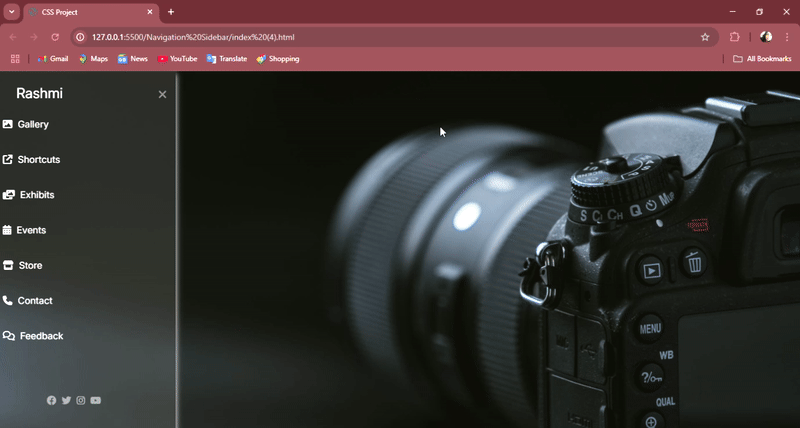

# Responsive Sidebar Navigation

A responsive sidebar navigation menu built using **HTML**, **CSS**, and **Font Awesome** icons. This project demonstrates how to create a sleek sidebar that slides in and out smoothly with a toggle button.

---

## 🚀 Features

- Sliding sidebar using a checkbox hack (no JavaScript)
- Responsive design (collapses on small screens)
- Font Awesome icons for a modern look
- Hover effects and social media links
- Clean UI with background image

---

