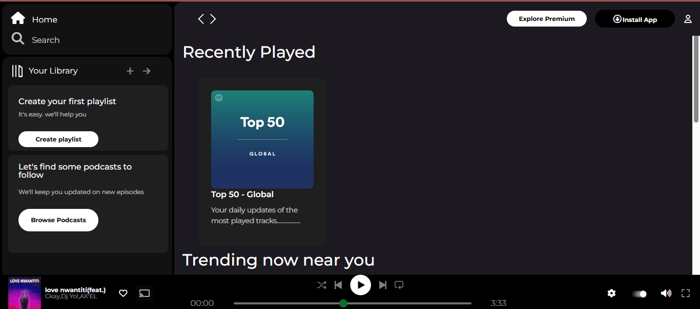
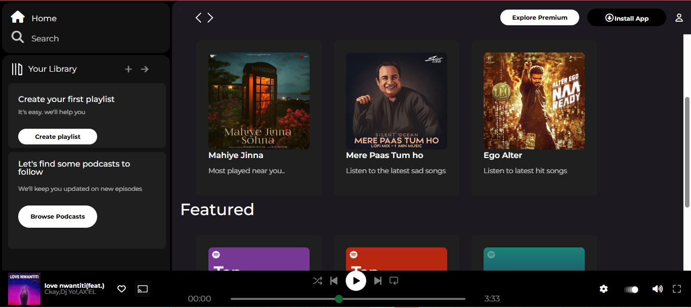
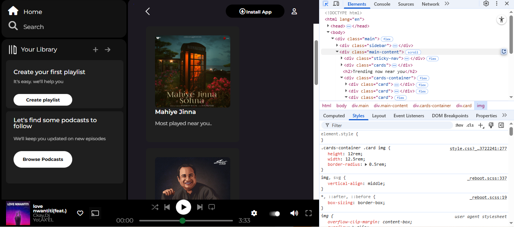

# 🎵 Spotify Clone - Web Music Player (Responsive)

This is a **Spotify-inspired Web Music Player** built using **HTML + CSS**. It features a sleek UI, sidebar navigation, music card sections, and a responsive layout — closely resembling the original Spotify web app.

## 📸 Screenshots

### Desktop View  

> *(Make sure to save your uploaded screenshots inside a `/screenshots` folder and name them like above)*

---

## 🚀 Features

- 🎧 Beautiful UI inspired by Spotify  
- 🎵 Music cards: Recently Played, Trending, and Featured  
- 📱 Fully responsive layout (mobile-friendly)  
- 🔍 Search bar and Library sidebar  
- 🎛️ Sticky music player at the bottom  
- 💚 Like and cast icons  
- 🎚️ Range-based progress bar with custom styling  

---

## 🛠️ Tech Stack

- **HTML5**
- **CSS3**
- **Font Awesome** for icons  
- **Google Fonts** (Montserrat)
- **Bootstrap** (used for some responsiveness and styling)

---

---

## 📲 How to Run

1. **Download or Clone** this repository  
2. Open `index.html` in any modern browser  
3. Enjoy the Spotify clone feel 🎧 

> 💡 No backend or JavaScript functionality is added yet. This is purely a UI-focused frontend clone.

---

## 💻 Responsiveness

This project uses **media queries** and flexible units (`rem`, `vh`, `vw`) to ensure it adapts to different screen sizes.

Tested on:
- ✅ Desktop (1366x768)
- ✅ Mobile widths (via DevTools)

---

## ✨ To-Do (Future Enhancements)

- Add JavaScript for real-time audio play
- Create playlists dynamically
- Store favorites using `localStorage`
- Integrate Spotify API for real data

---

## 👩‍💻 Developer

**Rashmi Naik**  
✨ Passionate frontend developer working on creative clones and UI/UX projects.

---

## 📜 License

This project is for educational and personal learning purposes only. Not intended for commercial use.

