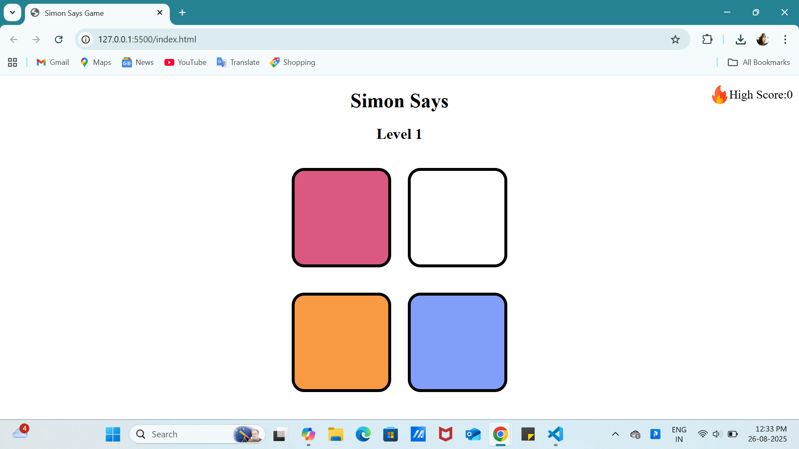

# 🎮 Simon Says Game

A simple **Simon Says memory game** built using **HTML, CSS, and JavaScript**.  
The goal of the game is to repeat the sequence of colors shown by the computer.  
Each correct sequence takes you to the next level, but one wrong click ends the game!  

---

## 🚀 Features
- 🔄 Random sequence generation  
- ✨ Button animations (flash effects)  
- 🎵 Sound effects for clicks & game over  
- 🏆 High Score tracking (stored until reset)  
- 🎨 Clean and simple UI  

---

## 🕹️ How to Play
1. Press any key to **start the game**.  
2. Watch the sequence of buttons flashing.  
3. **Click the buttons** in the exact order shown.  
4. If you succeed, you move to the **next level** (sequence gets longer).  
5. If you make a mistake → ❌ **Game Over**!  

---

---

## 🔧 Technologies Used
- HTML5  
- CSS3  
- JavaScript (DOM manipulation, event handling, audio)  

---

## 📸 Demo Screenshot

---

## 🎯 Future Improvements
- ✅ Add difficulty modes  
- ✅ Save high scores permanently (localStorage)  
- ✅ Mobile responsiveness  

---

## ▶️ Play the Game
You can play it locally by opening `index.html` in your browser.  

---

## 📝 Author
Developed with ❤️ by **Rashmi C Naik**  

